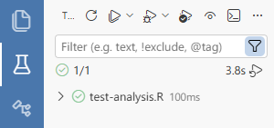

```{r, include = FALSE}
knitr::opts_chunk$set(
  collapse = TRUE,
  comment = "#>"
)
```

For academic researchers and data scientists using R, a common problem is that **the same code does not always produce the same results**.

Sometimes the difference is obvious. In worse cases, it happens silently — and you only notice much later, after results have been shared, revised, or even published.

Following best practices — such as clearing your workspace, using version control, and maintaining a clear project structure — can reduce this risk. I’ve written more about these workflows in this [blog post](https://opensource.posit.co/blog/2026-04-13_reproducible-research-renv-quarto-github/).

In practice, results can change due to:

1. implicit randomness
2. non-deterministic computation (e.g. parallelization)
3. changes in underlying data (e.g. APIs or databases)
4. package updates or dependency changes (even when using tools like `renv`)
5. platform differences (e.g. floating-point precision, OS-specific behaviour)

These issues make it difficult to detect when results have changed — and even harder to manage in *collaborative* projects.

`resultcheck` is designed to address this problem by letting you **explicitly track and verify key results** as your analysis evolves. Instead of tracking code, `resultcheck` tracks the **R objects created during your analysis**.

`resultcheck` is intended to be used *alongside* version control (e.g. Git), so that snapshots can be tracked, shared, and verified across collaborators.

The following sections walk through a typical workflow and show how `resultcheck` helps you detect and manage changes in your results.

## A typical workflow

`resultcheck` fits into your analysis workflow as follows:

1. Write your analysis
2. Add `snapshot()` calls to key results
3. Run once → snapshots are recorded
4. Commit snapshots to Git
5. Re-run code (locally or in CI)
6. If results change → tests fail

At that point, you decide:

- update the snapshot (if the change is expected), or
- investigate further (if the change is unexpected)

This allows you to detect unintended changes in results as your analysis evolves.

## Mark project root

The core idea behind `resultcheck`’s testing workflow is that it *copies* the files and directories you explicitly provide into a temporary directory, and runs the script there to mimic a clean environment.

This means you need to list any required inputs and helper files (for example, data files, sourced scripts, or other resources) that the script needs inside the sandbox.
To do this reliably, `resultcheck` needs to know where your **project root** is.

You can mark your project root by creating any of the following in the root directory. `resultcheck` will detect them in the following order:

1. `_resultcheck.yml`
2. `.Rproj`
3. `.git` (created automatically when you run `git init`)

You can verify that `resultcheck` has correctly identified your project root by running:

```r
resultcheck::find_root()
```

## (Optional) Configure `resultcheck` settings

You usually do not need to modify any settings, but you can customise `resultcheck` using a `_resultcheck.yml` file in your project root.

For example:

```yaml
# _resultcheck.yml
snapshot:
  precision: 10
  dir: "tests/_resultcheck_snaps"
  method: "print + str"
  method_defaults_file: "snapshot-method-overrides.yml"
  method_by_class:
    lm: summary
```
`precision`

Controls how many digits are used when comparing numeric values.

- Increase this if you need higher precision
- Decrease this to allow for small numerical differences across environments

`dir`

Specifies where snapshot files are stored, relative to the project root.

By default, snapshots are stored in: `tests/_resultcheck_snaps`

## Add snapshots to your analysis

The primary way to use `resultcheck` is to add `snapshot()` calls to your analysis script.

For example, if you have a script `analysis.R` that fits a model:

```r
model <- lm(mpg ~ wt, data = mtcars)
resultcheck::snapshot(model, "model")
```
You can also snapshot data frames, plots, tables, or any other R object.

Snapshots can be committed and shared, allowing collaborators to verify that their results match yours.

### First run: creating a snapshot

When you run the `snapshot()` line for the first time, a snapshot file is created. This establishes the baseline that future runs will be compared against.

For example:

```r
> resultcheck::snapshot(model, "model")
Warning: snapshot() will write a snapshot file to: path/to/your/project/tests/_resultcheck_snaps/analysis/model.md
✓ New snapshot saved: analysis/model.md
```

The file: `tests/_resultcheck_snaps/analysis/model.md` contains a human-readable representation of the model object.

Snapshots should be committed to **version control**. This allows you to track changes to your results over time, and collaborate with others without losing the ability to detect changes, and is needed for automated testing (see [GitHub Tests](#github-tests)).

### Snapshot representation

By default, `snapshot()` resolves methods in this order:

1. explicit `method=` argument,
2. class override from `_resultcheck.yml` (`snapshot.method_by_class`),
3. global default from `_resultcheck.yml` (`snapshot.method`),
4. fallback to `print + str`.

You can override this using the `method` argument:

```r
resultcheck::snapshot(model, "model", method = "print")
resultcheck::snapshot(model, "model", method = "str")
resultcheck::snapshot(model, "model", method = "print + summary")
resultcheck::snapshot(model, "model", method = c("summary", "print"))
```

`"both"` is still accepted as a deprecated alias for `"print + str"`.

### Tip: snapshot before writing outputs

If your analysis writes outputs to disk (e.g. `.RData`, `.csv`, tables, or plots), we recommend that you:

- **Create a snapshot for each important output**, and
- **Call `snapshot()` immediately before writing the file**

For example:

```r
model <- lm(mpg ~ wt, data = mtcars)

# snapshot the object
resultcheck::snapshot(model, "main_model")

# then write it to disk
save(model, file = "output/model.RData")
```

This ensures that:

- the snapshot always reflects the **latest version of the object**, and
- any unintended changes are detected **before they are written to disk**

In general, it is a good idea to snapshot the same objects that you would consider part of your final outputs.

### Subsequent runs: comparing against the snapshot

On subsequent runs, `snapshot()` compares the current value of the object against the stored snapshot.

If the results match, you will see:

```r
> resultcheck::snapshot(model, "model")
✓ Snapshot matches: model
```

If the results differ, you will see a message indicating the differences:

```r
> resultcheck::snapshot(model, "model")
Warning: 
Snapshot differences found for: model
File: path/to/your/project/tests/_resultcheck_snaps/analysis/model.md

Differences:
old[1:7] vs new[1:7]
  "# Snapshot: lm"
  ""
  "## List Structure"
- "List of 13"
+ "List of 12"
  " $ coefficients : Named num [1:2] 37.29 -5.34"
  "  ..- attr(*, \"names\")= chr [1:2] \"(Intercept)\" \"wt\""
  " $ residuals    : Named num [1:32] -2.28 -0.92 -2.09 1.3 -0.2 ..."
```
In interactive use, you will be prompted:

```
Update snapshot? (y/n):
```

- Press `y` to update the snapshot (if the change is expected)
- Press `n` to keep the existing snapshot and investigate further

In testing contexts (see [local tests](#local-tests) and [GitHub tests](#github-tests)), differences result in an error rather than an interactive prompt.

## Set up automated tests

In practice, analyses are often not rerun once they are considered “finished”, unless something breaks. To ensure that results remain stable over time, we recommend adding **automated tests** for scripts that you do not intend to modify further.

`resultcheck` works naturally with [`testthat`](https://testthat.r-lib.org/) to run these checks automatically.

For example, to test `analysis.R`, create a file `tests/testthat/test-analysis.R` with the following content:

```r
library(testthat)
library(resultcheck)

test_that("analysis produces stable results", {
  sandbox <- setup_sandbox()
  on.exit(cleanup_sandbox(sandbox), add = TRUE)

  expect_true(run_in_sandbox("analysis.R", sandbox))
})
```

This test:

- creates a temporary sandbox environment
- runs `analysis.R` inside it
- fails if any snapshot differs from the stored version

You can extend your tests to verify that your script produces the expected output files.

For example:

```r
  expect_true(
    file.exists(file.path(sandbox$path, "output/regModels.RData")),
    info = "regModels.RData not found"
  )
```

This is useful when your analysis produces files (e.g. model objects, tables, or figures) that you want to ensure are created correctly.

### Sandbox environment

The sandbox is a temporary directory that mimics a clean R session.

Because your script may depend on external files (e.g. data or helper scripts), you need to include those files when setting up the sandbox.

For example:

```r
sandbox <- setup_sandbox("data/weather.csv")
```

You can include multiple files:

```r
sandbox <- setup_sandbox(c("data/income.csv", "data/weather.csv"))
```

Or entire directories:

```r
sandbox <- setup_sandbox("data")
```

`resultcheck` will copy these files into the sandbox while preserving their relative structure.

## Running tests {#local-tests}

You can run your tests using `testthat::test_dir("tests/testthat")`.

If you are using [Positron](https://positron.posit.co/), you can run tests in the test pane once you have installed the [Positron R Tester extension](https://open-vsx.org/extension/kv9898/positron-r-tester). This provides a visual interface for running tests and inspecting results:



## Running tests on GitHub {#github-tests}

While you can run tests locally, it is often a good idea to run them automatically using [GitHub Actions](https://docs.github.com/en/actions).

This is especially useful for:

- **Collaborative projects** — tests run automatically on every push, helping catch unintended changes introduced by collaborators
- **Saving local resources** — running tests (especially sandboxed scripts) can take time and block your current R session

Using GitHub Actions allows tests to run in the cloud, so you don’t need to wait for them locally or manage multiple sessions.

### What you need

To set this up, you will need some familiarity with:

- `renv` (for managing package versions)
- Git and GitHub (for version control)
- GitHub Actions (for automation)

These tools are generally useful for reproducible research, and we recommend learning them if you are not already using them.

### Fully automated checks

Once configured, tests run automatically whenever you push changes to your repository.

This means:

- you don’t need to remember to run tests locally
- failures are caught immediately
- your results are continuously checked in a clean environment

> Think of this as moving your tests from "something you remember to run" to "something that runs automatically for you."

For a full walkthrough, see:

[👉 Automated Testing with GitHub Actions](renv-github-actions.html)
